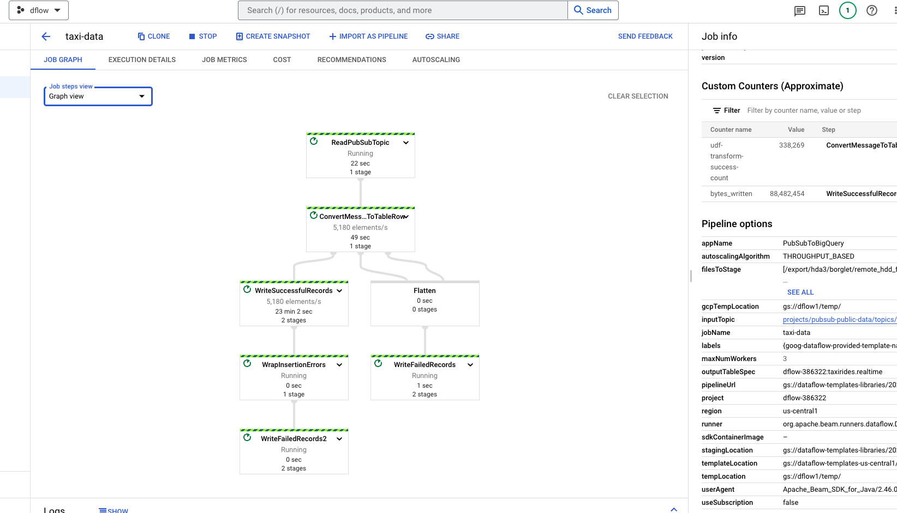
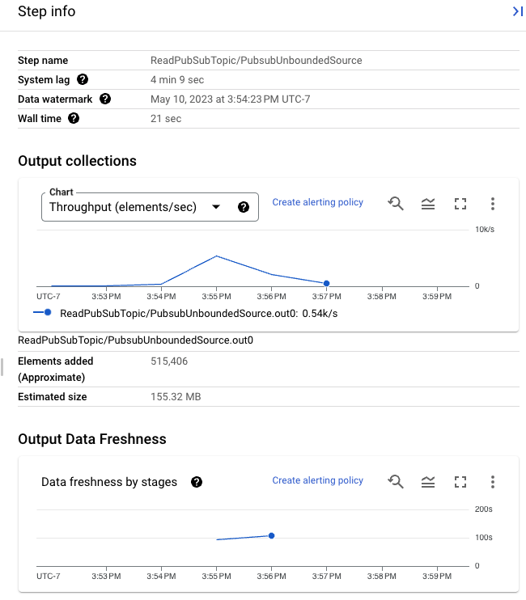

### 1. [Bring your own ML model to Beam RunInference](https://cloud.google.com/dataflow/docs/notebooks/run_custom_inference)
- `ner.ipynb` 
- `kekmodelhandler.ipynb`
- `modelhandler.py`
- `model.py`

```
pip install spacy pandas
pip install "apache-beam[gcp, dataframe, interactive]"
pip install urllib3==1.25.1
python -m spacy download en_core_web_sm
```

### 2. [Apache Beam RunInference for PyTorch](https://cloud.google.com/dataflow/docs/notebooks/run_inference_pytorch)
- `beam.py`
#### Use Bigquery
To get the bigquery.jobs.create permission in your GCP project, you should you the following:
- Create a project e.g. mlops,
  
Under the project:
  - Create service account
  - Go to IAM & Role, click grant accress, add the service account as new principals.
  - Assign necessary roles.
    - Each of the following predefined Identity and Access Management roles includes this permission:
  
        BigQuery Data Editor `(roles/bigquery.dataEditor)`

        BigQuery Data Owner `(roles/bigquery.dataOwner)`

        BigQuery Admin `(roles/bigquery.admin)`

        Storage Admin `toles/Storage Admin`

### 3. Streaming pipeline with Dataflow template
Follow the [tutorial](https://cloud.google.com/dataflow/docs/quickstarts/create-streaming-pipeline-template) to create a data pipeline using Google Cloud console UI.



  