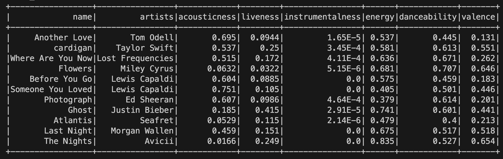
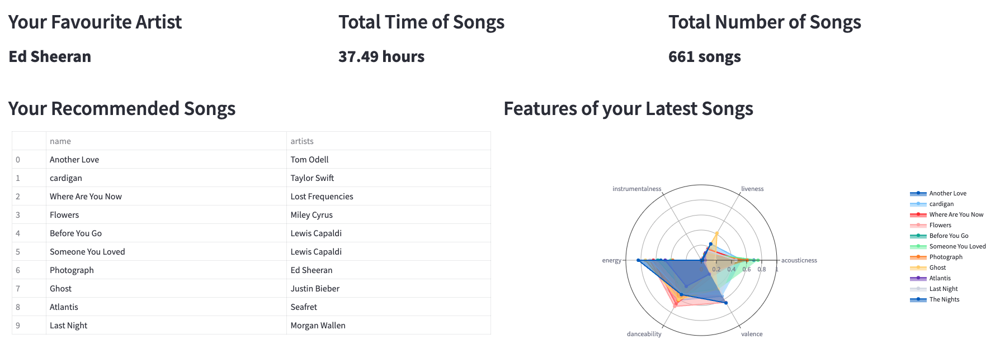
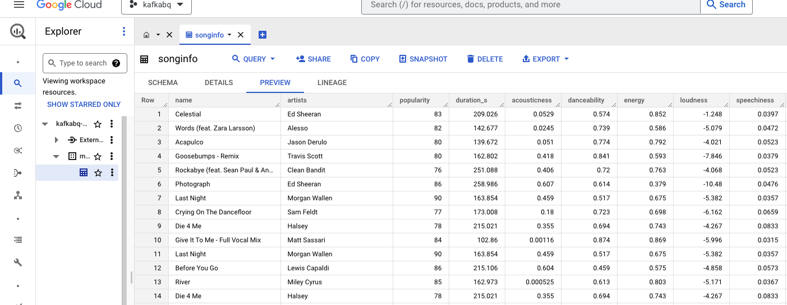

## Spotify Recommendation System using Pyspark and Kafka streaming, Bigquery
### Environment 
- Clone this [docker folder](https://github.com/wurstmeister/kafka-docker)
- You will get the folder named kafka-docker
  - Go to the folder and replace the `docker-compose.yml` in the folder with the one in this repository.
  - Run `docker-compose up -d` in the folder to create the docker image.

- Create a python virtual environment with the command: `python3 -m venv kaf` under this repository.
  - Run `. kaf/bin/activate`
  - Set up the python dependencies using `pip install -r requirements.txt` under the virtual env.

- Install [Java](https://www.java.com/en/download/) on your computer.
  - Make sure something shows up when entering `which java` in your terminal.

### Use Spotify API to get your favorite songs.
- [Tutorial](https://www.section.io/engineering-education/spotify-python-part-1/)
- Put your credentials into `cred.py`
- Get your songs using `get_songs.py`
  
### Three Experiments
### 1. `kafka_producer.py` + `kafka_consumer.py` 
- Simple Kafka producer and comsumer workflow.
- Run `kafka_producer.py` first and you can receive messages when running `kafka_consumer.py` afterwards.
  
### 2. `kafka_producer.py` + `stream.py`
- export `SPARK_LOCAL_IP="127.0.0.1"` if you have error: `Service ‘sparkDriver’ could not bind on a random free port.`
- Set spark version in `stream.py` line 10:
  - `os.environ['PYSPARK_SUBMIT_ARGS'] = '--packages org.apache.spark:spark-streaming-kafka-0-10_2.12:{your spark version},org.apache.spark:spark-sql-kafka-0-10_2.12:{your spark version} pyspark-shell'` 

  - Run `kafka_producer.py` first and `stream.py` later, you can get 10 (changable) recommended songs based on one random generated song in your song dataset.

  
### Streamlit
- Run `streamlit run dashboard.py` and see data visualization of your songs on the dashboard.

### 3. `kafka_producer.py` + `bq_consumer.py` 
#### Confluent_Kafka
- Using Confluent_kafka, which has built-in connector to Bigquery so we don't hve to manually setup configs for their connection.
#### Bigquery Setting
- Create a google service account and grant its access to Bigquery
- Create a creidential key, which is a ` .json` file that you download link its path to `service_account.Credentials.from_service_account_file("\your\path\to\.json")`
- Create a Bigquery project with a dataset and a table name, fill out this info: `table_id = 'PROJECT-ID.DATASET.TABLE-NAME'`
- Add table schema manually according to your data table.

You can now do data streaming to Bigquery!

#### Data visualization

- Go to [Looker Studio](https://lookerstudio.google.com/u/0/navigation/reporting), sign-in and select a blank report, connect Bigquery project, dataset, and table.
- You can create a report like [this](https://lookerstudio.google.com/u/0/reporting/b656c8a0-0b4d-41bf-aabf-c03780e05fe2/page/ISePD/edit) and more!

